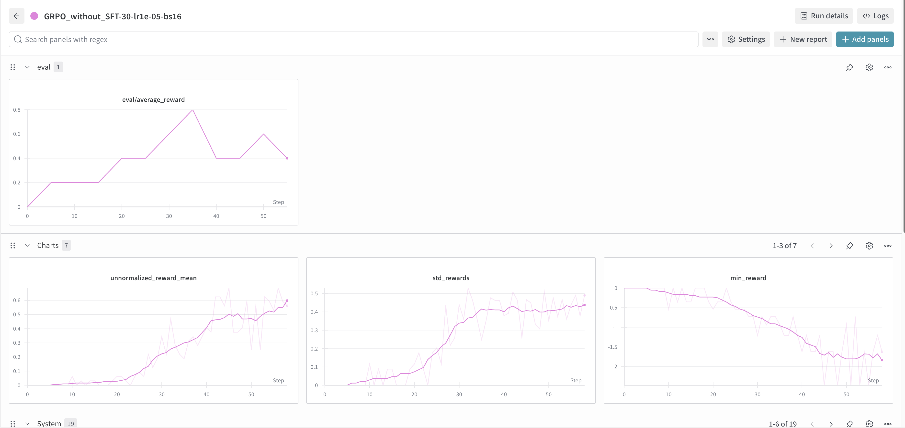
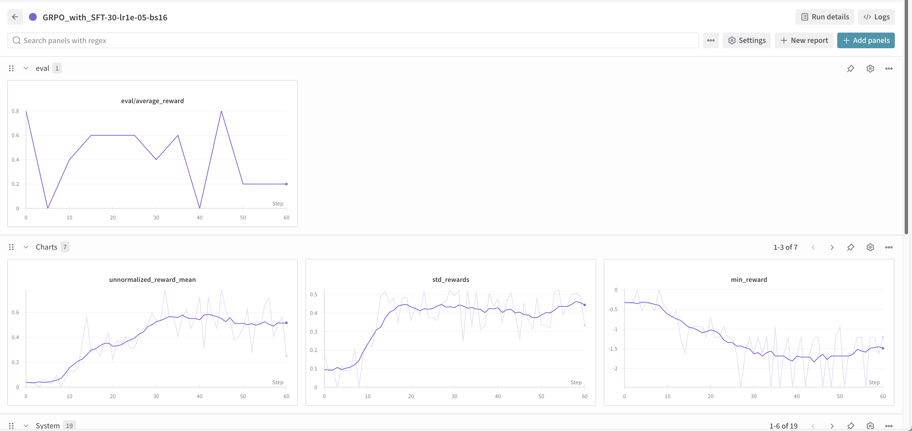
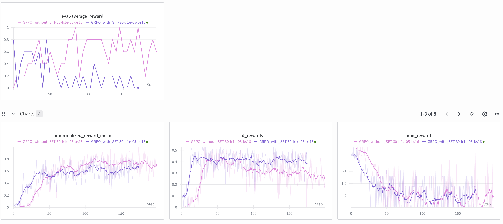

实验设置：
        分别对Qwen2.5-Math-1.5的Base Model； Qwen2.5-math-1.5B(进行150个step的SFT)的model进行GRPO训练,两个模型都进行200，查看结果：
        训练过程中生成的Prompt--answer对见本目录下的json文件

训练的结果：
        对于进行了150step的SFT模型，在进行GRPO时，能很快（10个step内）就能生成符合格式要求的<think></think> <answer></answer>思考结构答案，但是其正确率一般，还需要随着训练的进行缓慢上升
        而对 Base Model直接进行GRPO，模型也能很快的学会符合 COT结构的生成结果（30个step），同时也能快速提高数学能力

曲线：
直接在 BaseMoedel进行 GRPO:

在 SFT后的模型进行 GRPO：

曲线对比：

对比结果来看，直接进行 GRPO的效果居然比 SFT- GRPO的效果更高？

根据曲线的结果我们可以发现训练时的 reward在稳定上升，说明 GRPO能够提升模型的数学能力

新得体会：
        没卡真的做不了一点大型的训练，而且不能使用 VLLM->一把双刃剑：不用他生成 Group answer奇慢无比，一用他就直接OOM，难绷！